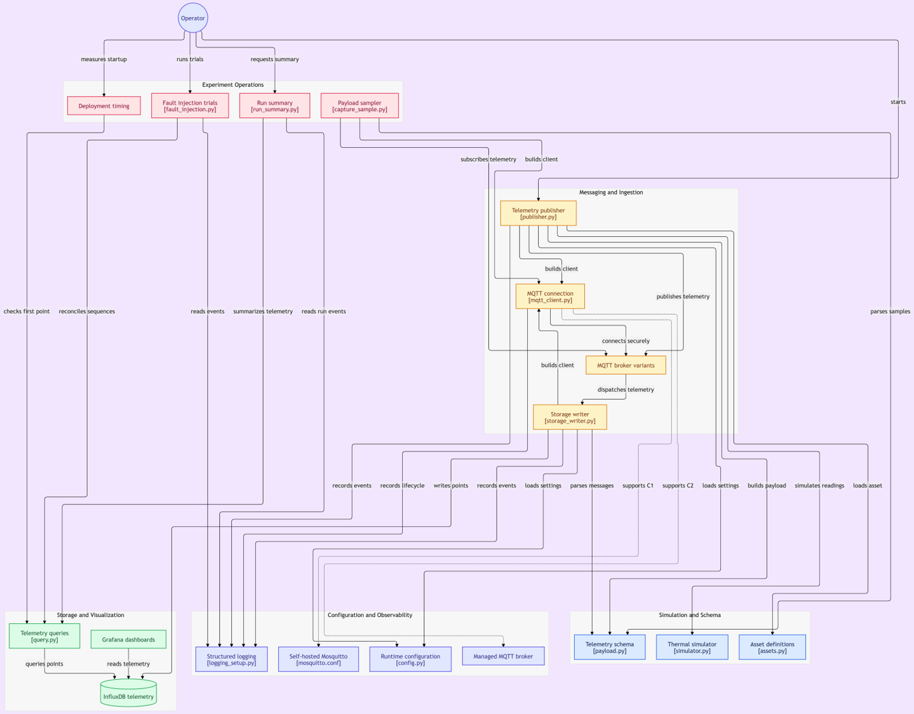

# Cloud-Native Digital Twin

This project is a small digital twin for monitoring thermal assets such as
boilers and HVAC systems. It simulates sensor readings, sends them through an
MQTT broker, stores them in InfluxDB, and displays them in Grafana.

The project compares three MQTT broker setups:

- **C1:** self-hosted Mosquitto
- **C2a:** HiveMQ Cloud with username and password authentication
- **C2b:** AWS IoT Core with mutual TLS authentication

The same simulator, telemetry format, storage, and dashboard are used for each
setup so that the broker configurations can be compared fairly.

## How it works


gitdigram used for image 

```text
Asset simulator -> MQTT publisher -> MQTT broker -> Storage writer -> InfluxDB -> Grafana
```

The asset configuration is loaded from `config/assets`. The simulator creates
temperature readings, the publisher validates and sends them, and the storage
writer subscribes to the MQTT topic and writes each reading to InfluxDB.

The main code is in `src/twin`:

- `simulator.py` - generates thermal asset readings
- `publisher.py` - publishes telemetry to MQTT
- `storage_writer.py` - reads MQTT messages and writes them to InfluxDB
- `payload.py` - defines and validates the telemetry payload
- `mqtt_client.py` - creates the MQTT connections
- `config.py` and `assets.py` - load environment and asset configuration

## Run the tests

You need Python 3.11 or later. From the project root, create a virtual
environment and install the development dependencies:

```bash
python -m venv .venv
```

Activate it on Linux or macOS:

```bash
source .venv/bin/activate
```

Or on Windows PowerShell:

```powershell
.venv\Scripts\Activate.ps1
```

Then install the dependencies and run the tests:

```bash
python -m pip install -r requirements.txt
python -m pytest -q
```

The tests cover the simulator, payload validation, configuration, MQTT client,
publisher, storage writer, and experiment tools. Most tests do not need Docker
or a live MQTT broker.

## Run the full system

The full system runs with Docker Compose. Docker, the Compose plugin, and broker
credentials are required.

Start by copying the environment template for the configuration you want to
use. For example, for C1:

```bash
cp config/env/c1.env.example config/env/c1.env
```

Add the required credentials to the new file, then follow the
[Ubuntu run guide](docs/run.md). C1 also needs local Mosquitto certificates and
a password file; these steps are covered in the [TLS setup](docs/tls-setup.md).

Once the stack is running, Grafana is available at
`http://localhost:3000`. The publisher sends a reading every 30 seconds by
default, so data should begin appearing on the dashboard shortly after startup.

## Project layout

```text
config/       Asset definitions and environment templates
deploy/       Docker Compose, Mosquitto, and Grafana configuration
docs/         Detailed project documentation
experiments/  Deployment, recovery, and run-summary tools
src/twin/     Digital twin application code
tests/        Automated tests
```

## Documentation

- [Architecture](docs/architecture.md) - components, data flow, and telemetry
- [Configuration](docs/configuration.md) - assets and environment variables
- [Development](docs/development.md) - code structure and test guidance
- [Operations](docs/operations.md) - deployment and troubleshooting
- [Ubuntu run guide](docs/run.md) - full setup and experiment commands
- [TLS setup](docs/tls-setup.md) - certificates and credentials for C1
- [Grafana](docs/grafana.md) - dashboard and data source setup
- [Tools and references](docs/tools.md) - main dependencies and useful links
